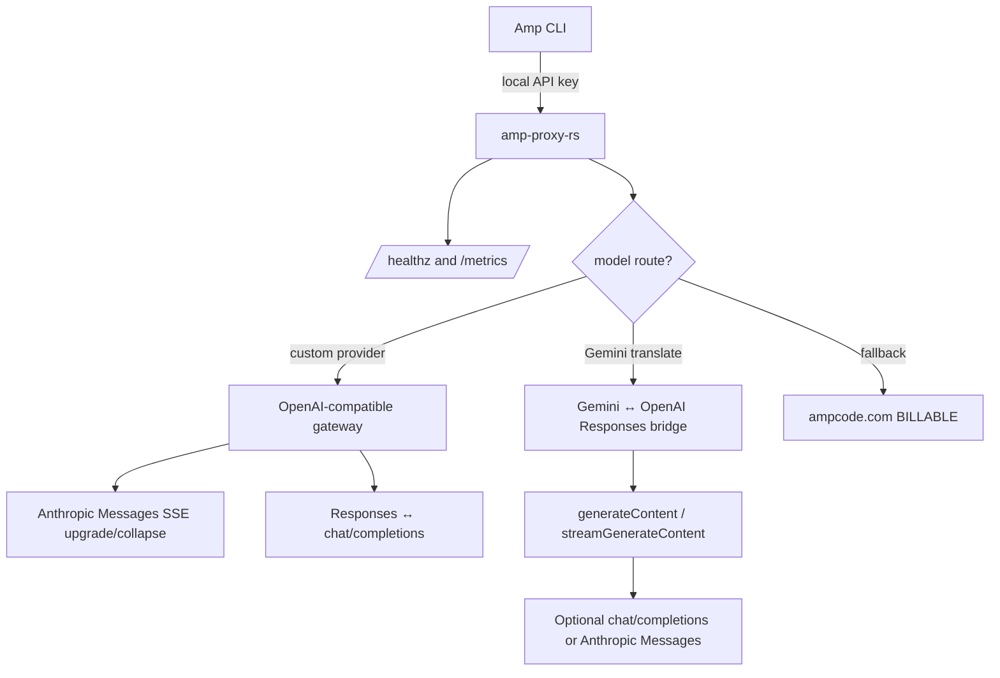

<div align="center">

# amp-proxy-rs

**A focused Rust reverse proxy for [Sourcegraph Amp CLI](https://ampcode.com)**

[](https://github.com/margbug01/amp-proxy-rs/actions/workflows/ci.yml)
[](LICENSE)
[](Cargo.toml)
[](https://github.com/margbug01/amp-proxy-rs/releases)

Route selected models to your own OpenAI-compatible providers, keep Amp control-plane traffic on ampcode.com, and watch every billable fallback.

[中文文档](README.md) · [Configuration example](config.example.yaml) · [Benchmarks](BENCHMARKS.md) · [Changelog](CHANGELOG.md)

</div>

---

## What it does

`amp-proxy-rs` sits between Amp CLI and upstream model providers. It inspects the requested model, rewrites protocol shapes when needed, and sends model traffic to your own gateway while preserving ampcode.com fallback for control-plane APIs.

| Capability | What you get |
|---|---|
| 🪶 Small release binary | LTO + strip + `opt-level = "z"`; no external runtime service required |
| 🔀 Dual-format Gemini bridge | Gemini can translate to OpenAI Responses, chat/completions, or Anthropic Messages across non-streaming and streaming paths |
| 🚿 Hybrid streaming | Peeks the first 16 KiB for routing, then streams the rest without buffering the whole request |
| 🔁 Hot reload | API keys, model mappings, and provider routing update from `config.yaml`; host/port still require restart |
| 🩺 Provider failover | Multiple providers can serve the same model; unhealthy primaries fail over and recover automatically |
| 📈 Prometheus metrics | `/metrics` exposes request counters, latency histogram, and billable fallback counter |
| 🧪 Tested paths | 159 unit tests plus real Amp CLI sessions for main agent, librarian, finder, and DeepSeek tool use |

---

## Quick start

```bash
git clone https://github.com/margbug01/amp-proxy-rs.git
cd amp-proxy-rs

cargo build --release
./target/release/amp-proxy init
./target/release/amp-proxy --config config.yaml
```

Point Amp CLI at the proxy:

```bash
export AMP_URL=http://127.0.0.1:8317
export AMP_API_KEY=<one of config.yaml api-keys>
amp
```

PowerShell:

```powershell
$env:AMP_URL = "http://127.0.0.1:8317"
$env:AMP_API_KEY = "<one of config.yaml api-keys>"
amp
```

On Windows, [`scripts/restart.ps1`](scripts/restart.ps1) provides a convenient restart + log redirection wrapper.

---

## Architecture



Important split:

- **Model traffic** can be routed to your own providers.
- **Amp control-plane traffic** such as `/api/internal` and `/api/telemetry` still falls back to ampcode.com.
- Every ampcode.com fallback emits a visible `BILLABLE` log line and increments `billable_requests_total`.

---

## Configuration

Minimal `config.yaml`:

```yaml
host: "127.0.0.1"
port: 8317

api-keys:
  - "change-me"

ampcode:
  upstream-url: "https://ampcode.com"
  upstream-api-key: "" # optional Amp session token

  custom-providers:
    - name: "primary-gateway"
      url: "http://localhost:8000/v1"
      api-key: "your-bearer-token"
      models:
        - "gpt-5.4"
        - "gpt-5.4-mini"
      responses-translate: true

    - name: "deepseek-anthropic"
      url: "https://api.deepseek.com/anthropic"
      api-key: "deepseek-token"
      models:
        - "deepseek-v4-flash"
      messages-translate: true

    - name: "backup-gateway"
      url: "http://localhost:8001/v1"
      api-key: "backup-token"
      models:
        - "gpt-5.4"

  model-mappings:
    - from: "claude-opus-4-6"
      to: "gpt-5.4(high)"

  force-model-mappings: true
  gemini-route-mode: "translate"
```

See the fully commented [config.example.yaml](config.example.yaml) for every field.

---

## Routing decisions

| Step | Condition | Action |
|---|---|---|
| 1 | Extract `model` from request body or Gemini URL path | Continue routing |
| 2 | `force-model-mappings` / `model-mappings` match | Rewrite the upstream `model` field |
| 3 | The resolved model appears in `custom-providers[*].models` | Send to the first healthy provider and inject its Bearer token |
| 4 | Multiple providers serve the same model | Fail over after consecutive transport failures; switch back after health recovery |
| 5 | Google Gemini path with `gemini-route-mode: translate` | Translate Gemini ↔ OpenAI Responses; if the provider sets `responses-translate` or `messages-translate`, continue to chat/completions or Anthropic Messages |
| 6 | Nothing matches | Fall back to ampcode.com and count as **billable** |

---

## Observability

| Signal | Details |
|---|---|
| Logs | `amp router:*`, `customproxy: forwarding`, `gemini-translate: forwarding`, and explicit `BILLABLE` fallback lines |
| Metrics | `/metrics` exposes `requests_total`, `request_duration_seconds`, and `billable_requests_total` |
| Capture tooling | `capture-pretty` converts body capture logs into structured JSON |

```bash
./target/release/amp-proxy capture-pretty ./capture/in.log --output ./capture/in.pretty.json
```

---

## Validation

```bash
cargo fmt --check
cargo test --all-features --no-fail-fast
cargo clippy --all-targets --all-features -- -D warnings
```

Current local result:

```text
test result: ok. 167 passed; 0 failed
```

---

## Friends

- [LINUX DO](https://linux.do/) — a friendly Linux / developer community.

---

## Credits

The protocol translation algorithms and custom-provider routing model are derived from [CLIProxyAPI](https://github.com/router-for-me/CLIProxyAPI) under the MIT license. See [NOTICE.md](NOTICE.md) for attribution.

## License

[MIT](LICENSE)
