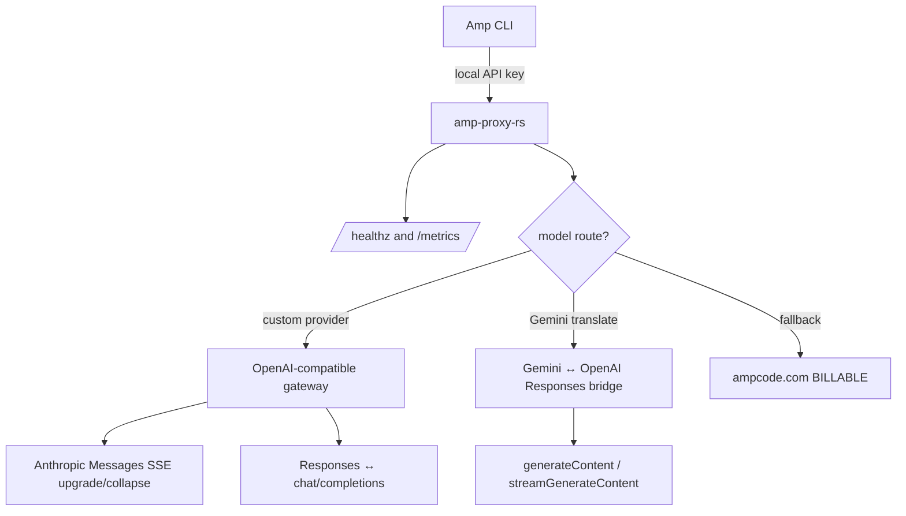

<div align="center">

# amp-proxy-rs

**A focused Rust reverse proxy for [Sourcegraph Amp CLI](https://ampcode.com)**

[](https://github.com/margbug01/amp-proxy-rs/actions/workflows/ci.yml)
[](LICENSE)
[](Cargo.toml)
[](https://github.com/margbug01/amp-proxy-rs/releases)

Route selected models to your own OpenAI-compatible providers, keep Amp control-plane traffic on ampcode.com, and watch every billable fallback.

[中文文档](README.zh-CN.md) · [Configuration example](config.example.yaml) · [Benchmarks](BENCHMARKS.md) · [Changelog](CHANGELOG.md)

</div>

---

## What it does

`amp-proxy-rs` sits between Amp CLI and upstream model providers. It inspects the requested model, rewrites protocol shapes when needed, and sends model traffic to your own gateway while preserving ampcode.com fallback for control-plane APIs.

| Capability | What you get |
|---|---|
| 🪶 Small release binary | LTO + strip + `opt-level = "z"`; no external runtime service required |
| 🔀 Five protocol translators | Anthropic Messages, OpenAI Responses, chat/completions, Gemini `generateContent`, and Gemini streaming |
| 🚿 Hybrid streaming | Peeks the first 16 KiB for routing, then streams the rest without buffering the whole request |
| 🔁 Hot reload | API keys, model mappings, and provider routing update from `config.yaml`; host/port still require restart |
| 🩺 Provider failover | Multiple providers can serve the same model; unhealthy primaries fail over and recover automatically |
| 📈 Prometheus metrics | `/metrics` exposes request counters, latency histogram, and billable fallback counter |
| 🧪 Tested paths | 159 unit tests plus real Amp CLI sessions for main agent, librarian, finder, and DeepSeek tool use |

---

## Quick start

```bash
git clone https://github.com/margbug01/amp-proxy-rs.git
cd amp-proxy-rs

# Build the optimized binary.
cargo build --release

# Generate a ready-to-run config.yaml interactively.
./target/release/amp-proxy init

# Start the proxy.
./target/release/amp-proxy --config config.yaml
```

Point Amp CLI at the proxy:

```bash
export AMP_URL=http://127.0.0.1:8317
export AMP_API_KEY=<one of config.yaml api-keys>
amp
```

PowerShell:

```powershell
$env:AMP_URL = "http://127.0.0.1:8317"
$env:AMP_API_KEY = "<one of config.yaml api-keys>"
amp
```

On Windows, [`scripts/restart.ps1`](scripts/restart.ps1) provides a convenient restart + log redirection wrapper.

---

## Architecture



Important split:

- **Model traffic** can be routed to your own providers.
- **Amp control-plane traffic** such as `/api/internal` and `/api/telemetry` still falls back to ampcode.com.
- Every ampcode.com fallback emits a visible `BILLABLE` log line and increments `billable_requests_total`.

---

## Configuration

Minimal `config.yaml`:

```yaml
host: "127.0.0.1"
port: 8317

api-keys:
  - "change-me"

ampcode:
  upstream-url: "https://ampcode.com"
  upstream-api-key: "" # optional Amp session token

  custom-providers:
    - name: "primary-gateway"
      url: "http://localhost:8000/v1"
      api-key: "your-bearer-token"
      models:
        - "gpt-5.4"
        - "gpt-5.4-mini"
      responses-translate: true # enable for chat/completions-only providers

    # Optional backup for the same model. The first healthy provider wins.
    - name: "backup-gateway"
      url: "http://localhost:8001/v1"
      api-key: "backup-token"
      models:
        - "gpt-5.4"

  model-mappings:
    - from: "claude-opus-4-6"
      to: "gpt-5.4(high)"

  force-model-mappings: true
  gemini-route-mode: "translate"
```

See the fully commented [config.example.yaml](config.example.yaml) for every field.

---

## Routing decisions

| Step | Condition | Action |
|---|---|---|
| 1 | Extract `model` from request body or Gemini URL path | Continue routing |
| 2 | `force-model-mappings` / `model-mappings` match | Rewrite the upstream `model` field |
| 3 | The resolved model appears in `custom-providers[*].models` | Send to the first healthy provider and inject its Bearer token |
| 4 | Multiple providers serve the same model | Fail over after consecutive transport failures; switch back after health recovery |
| 5 | Google Gemini path with `gemini-route-mode: translate` | Translate Gemini ↔ OpenAI Responses before forwarding |
| 6 | Nothing matches | Fall back to ampcode.com and count as **billable** |

---

## Protocol translators

| Translator | Purpose | File |
|---|---|---|
| Anthropic Messages SSE upgrade/collapse | Avoid content loss when upstream only behaves correctly as SSE | [`src/customproxy/sse_messages_collapser.rs`](src/customproxy/sse_messages_collapser.rs) |
| Gemini ↔ OpenAI Responses | Finder `:generateContent` path | [`src/customproxy/gemini_translator.rs`](src/customproxy/gemini_translator.rs) |
| Gemini streaming ↔ OpenAI Responses SSE | Finder `:streamGenerateContent` path | [`src/customproxy/gemini_stream_translator.rs`](src/customproxy/gemini_stream_translator.rs) |
| OpenAI Responses ↔ chat/completions | DeepSeek and other chat-only upstreams | [`src/customproxy/responses_translator.rs`](src/customproxy/responses_translator.rs) |
| OpenAI Responses SSE stream translator | Streaming response path for chat-only upstreams | [`src/customproxy/responses_stream_translator.rs`](src/customproxy/responses_stream_translator.rs) |

---

## Observability

### Logs

Every Amp route emits a paired request/response trace:

| Prefix | Meaning |
|---|---|
| `amp router: request` | Routing decision, requested/resolved model, provider, stream mode |
| `amp router: response` | Final status and elapsed time |
| `customproxy: forwarding` | Actual custom-provider outbound request |
| `gemini-translate: forwarding` | Gemini bridge path and stream mode |
| `ampcode fallback: forwarding (BILLABLE — uses Amp credits)` | Request went to ampcode.com fallback |

Useful checks:

```bash
# Model traffic accidentally reaching ampcode.com?
grep BILLABLE run.log | grep -v "/api/internal\|/api/telemetry\|/news.rss"

# Translator or upstream warnings
grep WARN run.log
```

More verbose logs:

```bash
RUST_LOG=amp_proxy=debug,tower_http=info ./target/release/amp-proxy --config config.yaml
```

### Prometheus metrics

`/metrics` is intentionally unauthenticated for local Prometheus scraping.

| Metric | Meaning |
|---|---|
| `requests_total` | HTTP request count, excluding `/metrics` itself |
| `request_duration_seconds` | Latency histogram, sum, and count |
| `billable_requests_total` | Requests forwarded to ampcode.com fallback |

---

## Debug body capture

Debug middleware is disabled by default because captured bodies may contain prompts, tool calls, or secrets.

```yaml
debug:
  access-log-model-peek: true
  capture-path-substring: "/v1/responses"
  capture-dir: "./capture"
```

Captured headers are redacted for common secret-bearing names. Bodies are preserved as-is, so use capture only on trusted machines.

Convert a capture `.log` file into structured pretty JSON:

```bash
./target/release/amp-proxy capture-pretty ./capture/20260427-120000-000-POST-_v1_responses.log
./target/release/amp-proxy capture-pretty ./capture/in.log --output ./capture/in.pretty.json
```

Output shape:

```json
{
  "request": { "method": "POST", "path": "/v1/responses", "headers": {}, "body": {} },
  "response": { "status": 200, "headers": {}, "body": {} }
}
```

---

## Validation

```bash
cargo fmt --check
cargo test --all-features --no-fail-fast
cargo clippy --all-targets --all-features -- -D warnings
```

Current local result:

```text
test result: ok. 159 passed; 0 failed
```

Benchmark notes live in [BENCHMARKS.md](BENCHMARKS.md). The current benchmark conclusion is that `simd-json` is slower for the drop-in compatible translator path, so `serde_json` remains the default.

---

## Verified end-to-end paths

| Path | Verification |
|---|---|
| `claude-sonnet-4-6` main agent + librarian → custom upstream | 9 calls, all 200, zero WARN |
| `gemini-3-flash-preview` finder → translated upstream | 17 calls, all 200, zero model-traffic BILLABLE fallback |
| `gpt-5.4` → DeepSeek via Responses ↔ chat/completions | Multi-turn reasoning + tool use |
| `/api/internal`, `/api/telemetry` → ampcode.com | Correct control-plane fallback |

---

## Roadmap status

The previous README roadmap items are now implemented:

| Item | Status |
|---|---|
| Prometheus `/metrics` endpoint | ✅ Done |
| Provider health checks + automatic failover | ✅ Done |
| Body capture pretty-print tool | ✅ Done |

---

## Credits

The protocol translation algorithms and custom-provider routing model are derived from [CLIProxyAPI](https://github.com/router-for-me/CLIProxyAPI) under the MIT license. See [NOTICE.md](NOTICE.md) for attribution.

## License

[MIT](LICENSE)
