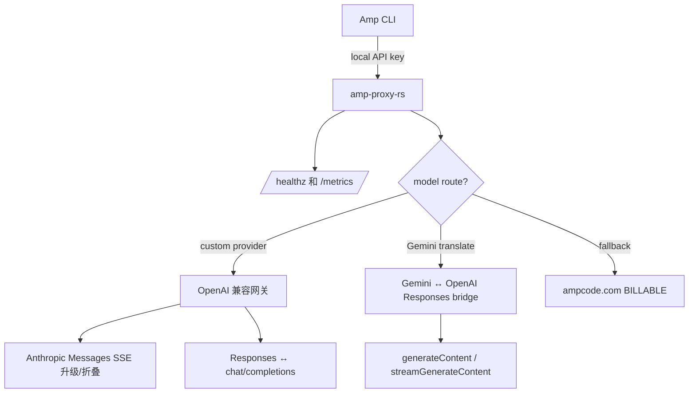

<div align="center">

# amp-proxy-rs

**专注于 [Sourcegraph Amp CLI](https://ampcode.com) 的 Rust 反向代理**

[](https://github.com/margbug01/amp-proxy-rs/actions/workflows/ci.yml)
[](LICENSE)
[](Cargo.toml)
[](https://github.com/margbug01/amp-proxy-rs/releases)

把指定 model 路由到你自己的 OpenAI 兼容网关，控制面流量保留给 ampcode.com，并清楚记录每一次 billable 兜底。

[English](README.md) · [配置示例](config.example.yaml) · [基准测试](BENCHMARKS.md) · [更新日志](CHANGELOG.md)

</div>

---

## 它解决什么问题

`amp-proxy-rs` 位于 Amp CLI 和上游模型服务之间。它会读取请求里的 model，按配置决定走自定义网关还是 ampcode.com；必要时自动做协议翻译，让 Amp CLI 能稳定使用 OpenAI 兼容网关、DeepSeek、Gemini bridge 等路径。

| 能力 | 说明 |
|---|---|
| 🪶 小体积 release 二进制 | LTO + strip + `opt-level = "z"`，无需额外运行时服务 |
| 🔀 五个协议翻译器 | Anthropic Messages、OpenAI Responses、chat/completions、Gemini 非流式与流式 |
| 🚿 混合流式转发 | 只 peek 前 16 KiB 做路由，后续 body 继续流式转发 |
| 🔁 配置热重载 | API key、model mapping、provider 路由可热更新；监听地址变更仍需重启 |
| 🩺 Provider failover | 同一个 model 可配置多个上游，主上游异常后自动切换，恢复后切回 |
| 📈 Prometheus 指标 | `/metrics` 暴露请求数、耗时 histogram、billable 兜底计数 |
| 🧪 覆盖验证 | 159 个单元测试，并用真实 Amp CLI 验证 main agent / librarian / finder / DeepSeek tool use |

---

## 快速开始

```bash
git clone https://github.com/margbug01/amp-proxy-rs.git
cd amp-proxy-rs

# 构建优化二进制
cargo build --release

# 交互式生成 config.yaml
./target/release/amp-proxy init

# 启动代理
./target/release/amp-proxy --config config.yaml
```

把 Amp CLI 指向本代理：

```bash
export AMP_URL=http://127.0.0.1:8317
export AMP_API_KEY=<config.yaml 里的某个 api-keys>
amp
```

PowerShell：

```powershell
$env:AMP_URL = "http://127.0.0.1:8317"
$env:AMP_API_KEY = "<config.yaml 里的某个 api-keys>"
amp
```

Windows 下可以用 [`scripts/restart.ps1`](scripts/restart.ps1) 一键重启并重定向日志。

---

## 架构



关键分工：

- **模型流量** 可以转发到你自己的 provider。
- **Amp 控制面流量**，例如 `/api/internal`、`/api/telemetry`，仍然兜底到 ampcode.com。
- 每次 ampcode.com 兜底都会打 `BILLABLE` 日志，并增加 `billable_requests_total`。

---

## 配置

最小 `config.yaml`：

```yaml
host: "127.0.0.1"
port: 8317

api-keys:
  - "change-me"

ampcode:
  upstream-url: "https://ampcode.com"
  upstream-api-key: "" # 可选 Amp session token

  custom-providers:
    - name: "primary-gateway"
      url: "http://localhost:8000/v1"
      api-key: "your-bearer-token"
      models:
        - "gpt-5.4"
        - "gpt-5.4-mini"
      responses-translate: true # chat/completions-only 上游才需要

    # 可选备份上游：同一个 model 可配置多个 provider，第一个健康 provider 优先。
    - name: "backup-gateway"
      url: "http://localhost:8001/v1"
      api-key: "backup-token"
      models:
        - "gpt-5.4"

  model-mappings:
    - from: "claude-opus-4-6"
      to: "gpt-5.4(high)"

  force-model-mappings: true
  gemini-route-mode: "translate"
```

完整字段说明见 [config.example.yaml](config.example.yaml)。

---

## 路由决策

| 步骤 | 条件 | 动作 |
|---|---|---|
| 1 | 从 body 或 Gemini URL path 提取 `model` | 进入路由判断 |
| 2 | `force-model-mappings` / `model-mappings` 命中 | 改写上游请求里的 `model` 字段 |
| 3 | 解析后的 model 出现在 `custom-providers[*].models` | 转发到第一个健康 provider，并注入 Bearer token |
| 4 | 多个 provider 服务同一个 model | 连续传输失败后切到后备；探活恢复后切回主上游 |
| 5 | Google Gemini 路径且 `gemini-route-mode: translate` | 先做 Gemini ↔ OpenAI Responses 翻译再转发 |
| 6 | 以上都不命中 | 兜底到 ampcode.com，计为 **billable** |

---

## 协议翻译器

| 翻译器 | 用途 | 文件 |
|---|---|---|
| Anthropic Messages SSE 升级/折叠 | 修复上游非流式 `/messages` 内容丢失类问题 | [`src/customproxy/sse_messages_collapser.rs`](src/customproxy/sse_messages_collapser.rs) |
| Gemini ↔ OpenAI Responses | finder 的 `:generateContent` 路径 | [`src/customproxy/gemini_translator.rs`](src/customproxy/gemini_translator.rs) |
| Gemini streaming ↔ OpenAI Responses SSE | finder 的 `:streamGenerateContent` 路径 | [`src/customproxy/gemini_stream_translator.rs`](src/customproxy/gemini_stream_translator.rs) |
| OpenAI Responses ↔ chat/completions | DeepSeek 等 chat-only 上游 | [`src/customproxy/responses_translator.rs`](src/customproxy/responses_translator.rs) |
| OpenAI Responses SSE 流式翻译 | chat-only 上游的流式响应路径 | [`src/customproxy/responses_stream_translator.rs`](src/customproxy/responses_stream_translator.rs) |

---

## 可观测性

### 日志

每个 Amp 路由请求会有成对的 request / response 日志：

| 前缀 | 含义 |
|---|---|
| `amp router: request` | 路由决策、请求/解析后 model、provider、streaming 信息 |
| `amp router: response` | 最终状态码与耗时 |
| `customproxy: forwarding` | 实际发往 custom provider 的请求 |
| `gemini-translate: forwarding` | Gemini bridge 分支与 stream 模式 |
| `ampcode fallback: forwarding (BILLABLE — uses Amp credits)` | 请求兜底到了 ampcode.com |

常用排查命令：

```bash
# 检查模型流量是否误走 ampcode.com
grep BILLABLE run.log | grep -v "/api/internal\|/api/telemetry\|/news.rss"

# 查看翻译器或上游警告
grep WARN run.log
```

更详细日志：

```bash
RUST_LOG=amp_proxy=debug,tower_http=info ./target/release/amp-proxy --config config.yaml
```

### Prometheus 指标

`/metrics` 默认免鉴权，方便本机或内网 Prometheus 抓取。

| 指标 | 含义 |
|---|---|
| `requests_total` | HTTP 请求总数，不含 `/metrics` 自身 |
| `request_duration_seconds` | 请求耗时 histogram / sum / count |
| `billable_requests_total` | 转发到 ampcode.com 兜底的次数 |

---

## Debug body capture

调试 middleware 默认关闭，因为捕获内容可能包含 prompt、tool call 或敏感上下文。

```yaml
debug:
  access-log-model-peek: true
  capture-path-substring: "/v1/responses"
  capture-dir: "./capture"
```

捕获文件会对常见敏感 header 做脱敏；body 会按原样保留，所以只建议在可信机器上开启。

把 capture `.log` 转成结构化 pretty JSON：

```bash
./target/release/amp-proxy capture-pretty ./capture/20260427-120000-000-POST-_v1_responses.log
./target/release/amp-proxy capture-pretty ./capture/in.log --output ./capture/in.pretty.json
```

输出结构：

```json
{
  "request": { "method": "POST", "path": "/v1/responses", "headers": {}, "body": {} },
  "response": { "status": 200, "headers": {}, "body": {} }
}
```

---

## 验证

```bash
cargo fmt --check
cargo test --all-features --no-fail-fast
cargo clippy --all-targets --all-features -- -D warnings
```

当前本地结果：

```text
test result: ok. 159 passed; 0 failed
```

性能基准见 [BENCHMARKS.md](BENCHMARKS.md)。当前结论是：在 drop-in 兼容翻译路径里，`simd-json` 反而更慢，因此继续使用 `serde_json`。

---

## 已验证的端到端路径

| 路径 | 验证情况 |
|---|---|
| `claude-sonnet-4-6` main agent + librarian → custom upstream | 9 次调用全 200，零 WARN |
| `gemini-3-flash-preview` finder → translated upstream | 17 次调用全 200，无模型流量 BILLABLE 兜底 |
| `gpt-5.4` → DeepSeek via Responses ↔ chat/completions | 多轮 reasoning + tool use |
| `/api/internal`、`/api/telemetry` → ampcode.com | 控制面正确兜底 |

---

## 路线图状态

README 里原来的路线图项目已经完成：

| 项目 | 状态 |
|---|---|
| Prometheus `/metrics` endpoint | ✅ 已完成 |
| Provider health checks + automatic failover | ✅ 已完成 |
| Body capture pretty-print tool | ✅ 已完成 |

---

## 致谢

协议翻译算法与 custom-provider 路由模型源自 [CLIProxyAPI](https://github.com/router-for-me/CLIProxyAPI)，许可证为 MIT。归属信息见 [NOTICE.md](NOTICE.md)。

## License

[MIT](LICENSE)
